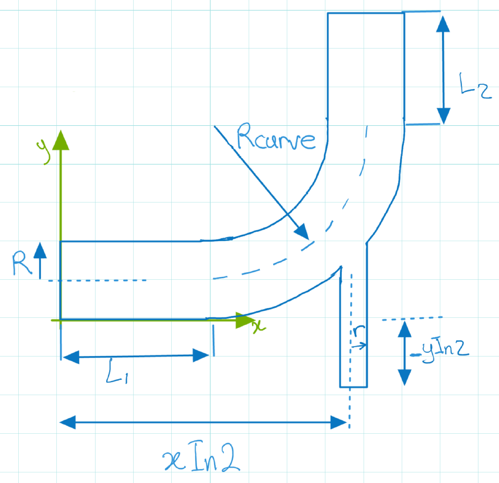

A Swift workflow for running flow in a 3D Elbow geometry.

Geometry
--------

The geometric parameters are specified in `inputs/sweepParams.run`. The parameters are shown below:

Metric Extraction
-----------------

Metric extraction is specified in `inputs/elbowKPI.json`. For documentation of metric extraction see <https://github.com/parallelworks/MetricExtraction>
